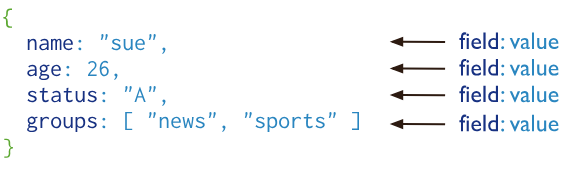

# MongoDB简介

MongoDB是一个开源的文档数据库，提供了高性能、高可用和自动缩放的特性。

### 文档数据库

一条记录在MongoDB中是一个文档，由多个键值对组成。MongoDB文档类似于JSON对象。值（value of field）可以包含其他文档、数组或者文档集合（arrays of documents）。

使用文档的优势：

* 文档和很多编程语言的原生数据类型相似
* 内嵌的文档和数组减少了昂贵的连接查询`（不过有些设计师仍会使用MongoDB的连接查询，并且MongoDB自己也为文档间的连接查询做了设计）`
* 文档动态的架构支持流畅的多态`（翻译的好生硬，Dynamic schema supports fluent polymorphism.想存什么字段就存什么字段，别想多了，肯定有限制）`

### 关键特性

#### 高性能

MongoDB提供高性能数据持久，特别是：

* 支持嵌入的数据模型以减少数据库系统的I/O活动
* 索引不仅支持较快的查询，还可以对嵌套文档和数组中的键创建索引

#### 丰富的查询语言

MongoDB提供丰富的查询语言以支撑[`读与写操作（CRUD）`](https://docs.mongodb.com/manual/crud/)`，以及：`

* [数据聚合](https://docs.mongodb.com/manual/core/aggregation-pipeline/)
* [全文检索](https://docs.mongodb.com/manual/text-search/)和[地理空间查询](https://docs.mongodb.com/manual/tutorial/geospatial-tutorial/)

#### 高可用

MongoDB的复制设施，称为[副本集（replica set）](https://docs.mongodb.com/manual/replication/)，提供：

* 自动故障转移
* 数据冗余

一个副本集是一组MongoDB服务器，维护同样的数据集，提供数据冗余和提高数据可用性

#### 水平伸缩（Horizontal Scalability）

水平伸缩是MongoDB的核心功能的一部分：

* 在集群机器中进行[数据分片](https://docs.mongodb.com/manual/sharding/#sharding-introduction)
* 从3.4版本开始，MongoDB支持通过[分片键（shard key）](https://docs.mongodb.com/manual/reference/glossary/#term-shard-key) 创建数据[区域（zones）](https://docs.mongodb.com/manual/core/zone-sharding/#zone-sharding)。在一个负载均衡集群中，MongoDB直接读写分片所在的区域。更多信息请进入[区域（zones）](https://docs.mongodb.com/manual/core/zone-sharding/#zone-sharding)手册页面查阅。

#### 支持多种存储引擎

MongoDB支持多种[存储引擎](https://docs.mongodb.com/manual/core/storage-engines/)：

* [WiredTiger Storage Engine](https://docs.mongodb.com/manual/core/wiredtiger/) （包括支持 [Encryption at Rest](https://docs.mongodb.com/manual/core/security-encryption-at-rest/)）
* [In-Memory Storage Engine](https://docs.mongodb.com/manual/core/inmemory/)
* [MMAPv1 Storage Engine](https://docs.mongodb.com/manual/core/mmapv1/)

此外，MongoDB提供了可插拔的存储API，允许第三方开发存储引擎在MongoDB中使用。

